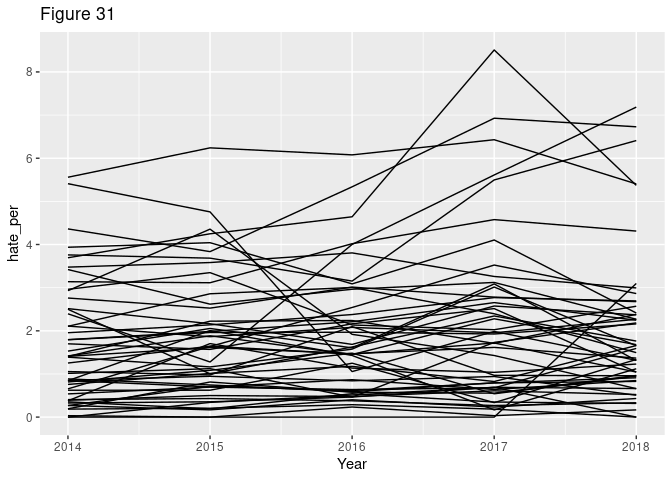

    # reading in our data

    hate_crimes <- read_csv("~/Stats 316 F20/Project/David_Ella/hatecrimesfull.csv")

    ## Parsed with column specification:
    ## cols(
    ##   .default = col_double(),
    ##   State = col_character()
    ## )

    ## See spec(...) for full column specifications.

    # 5 number summaries for all numeric variables

    favstats(hate_crimes$Noncitizen)

    ##   min   Q1 median   Q3  max      mean         sd   n missing
    ##  0.01 0.03   0.04 0.07 0.14 0.0485098 0.02969886 255       0

    # median = 0.04, mean = 0.0485: there is a slight difference 
    #    between the median and mean, suggests that 
    #    the data might be slightly skewed

    favstats(hate_crimes$MedIncome)

    ##    min    Q1 median      Q3   max     mean      sd   n missing
    ##  37714 54809  61072 68949.5 86345 61707.55 9954.34 255       0

    # This data doesn't appear to be skewed. 
    #    We should keep in mind that the medIncome 
    #    probably looks more similar within state to between state

    favstats(hate_crimes$Unemployed)

    ##    min     Q1 median    Q3   max       mean         sd   n missing
    ##  0.022 0.0365  0.045 0.055 0.079 0.04661961 0.01245403 255       0

    # This data doesn't appear to be skewed
    # Note: these represent percentages, so min = 2.2% and max = 7.9%

    favstats(hate_crimes$White_Poverty)

    ##   min   Q1 median   Q3  max      mean         sd   n missing
    ##  0.05 0.08    0.1 0.12 0.18 0.1013725 0.02478408 255       0

    # No skew apparent from this summary

    favstats(hate_crimes$GINI2016)

    ##     min     Q1 median   Q3   max      mean         sd   n missing
    ##  0.4081 0.4519  0.468 0.48 0.542 0.4663608 0.02194989 255       0

    # No skew apparent from this summary

    favstats(hate_crimes$HS_Degree)

    ##    min    Q1 median    Q3   max      mean         sd   n missing
    ##  0.799 0.839  0.874 0.898 0.918 0.8691176 0.03380388 255       0

    # No skew apparent from this summary

    favstats(hate_crimes$share_voters_voted_trump)

    ##   min   Q1 median   Q3 max mean        sd   n missing
    ##  0.04 0.41   0.49 0.58 0.7 0.49 0.1177713 255       0

    # Mean = median in this case!

    favstats(hate_crimes$hate_per)

    ##  min        Q1   median       Q3      max     mean       sd   n missing
    ##    0 0.6931579 1.604145 2.665101 30.32223 2.220339 3.093259 255       0

    # Skewed data here: mean is 38% greater than the median

    # table showing the distribution of unemployment for each year

    kable(table(hate_crimes$Year, cut_interval(hate_crimes$Unemployed, 5)))

<table>
<thead>
<tr>
<th style="text-align:left;">
</th>
<th style="text-align:right;">
\[0.022,0.0334\]
</th>
<th style="text-align:right;">
(0.0334,0.0448\]
</th>
<th style="text-align:right;">
(0.0448,0.0562\]
</th>
<th style="text-align:right;">
(0.0562,0.0676\]
</th>
<th style="text-align:right;">
(0.0676,0.079\]
</th>
</tr>
</thead>
<tbody>
<tr>
<td style="text-align:left;">
2014
</td>
<td style="text-align:right;">
1
</td>
<td style="text-align:right;">
7
</td>
<td style="text-align:right;">
11
</td>
<td style="text-align:right;">
21
</td>
<td style="text-align:right;">
11
</td>
</tr>
<tr>
<td style="text-align:left;">
2015
</td>
<td style="text-align:right;">
2
</td>
<td style="text-align:right;">
18
</td>
<td style="text-align:right;">
16
</td>
<td style="text-align:right;">
13
</td>
<td style="text-align:right;">
2
</td>
</tr>
<tr>
<td style="text-align:left;">
2016
</td>
<td style="text-align:right;">
9
</td>
<td style="text-align:right;">
12
</td>
<td style="text-align:right;">
22
</td>
<td style="text-align:right;">
7
</td>
<td style="text-align:right;">
1
</td>
</tr>
<tr>
<td style="text-align:left;">
2017
</td>
<td style="text-align:right;">
13
</td>
<td style="text-align:right;">
17
</td>
<td style="text-align:right;">
18
</td>
<td style="text-align:right;">
2
</td>
<td style="text-align:right;">
1
</td>
</tr>
<tr>
<td style="text-align:left;">
2018
</td>
<td style="text-align:right;">
17
</td>
<td style="text-align:right;">
24
</td>
<td style="text-align:right;">
8
</td>
<td style="text-align:right;">
2
</td>
<td style="text-align:right;">
0
</td>
</tr>
</tbody>
</table>
    # The unemployment rate dropped significantly from 2014 to 2018

    # univariate histograms

    # histogram of state population share that is noncitizen
    ggplot(data = hate_crimes) +
      geom_histogram(aes(x = Noncitizen), bins = 20) +
      labs(title = "Figure 1")

    # Noncitizen population share is concentrated largely below ~7%

    # histogram of state-wide median income
    ggplot(data = hate_crimes) +
      geom_histogram(aes(x = MedIncome), bins = 30) +
      labs(title = "Figure 2")

    # Median income appears to somewhat follow a normal distribution

    # histogram of state population share that is nonwhite
    ggplot(data = hate_crimes) +
      geom_histogram(aes(x = Nonwhite), bins = 30) +
      labs(title = "Figure 3")

    # Nonwhite population share is concentrated largely below 40%

    # histogram of state-wide unemployment rate
    ggplot(data = hate_crimes) +
      geom_histogram(aes(x = Unemployed), bins = 30) +
      labs(title = "Figure 4")

    # Unemployment rate appears to somewhat follow a normal distribution

    # histogram of state-wide poverty rate among whites
    ggplot(data = hate_crimes) +
      geom_histogram(aes(White_Poverty), bins = 15) +
      labs(title = "Figure 5")

    # Share of white population in poverty somewhat follows a normal distribution

    # histogram of state's GINI index
    ggplot(data = hate_crimes) +
      geom_histogram(aes(x = GINI2016), bins = 15) +
      labs(title = "Figure 6")

    # GINI index is concentrated largely between 0.45 and 0.48

    # histogram of state share of population with HS degree
    ggplot(data = hate_crimes) +
      geom_histogram(aes(x = HS_Degree), bins = 25) +
      labs(title = "Figure 7")

    # Population share with HS degree is slightly left skewed
    #   (but primarily constant across 80% to 92%)

    # histogram of trump's share of votes in state
    ggplot(data = hate_crimes) +
      geom_histogram(aes(x = share_voters_voted_trump), bins = 25) +
      labs(title = "Figure 8")

    # One very low outlier for vote share for Trump 
    #    (that point is Washington DC)

    # histogram of number of hate crimes per 100k in state
    ggplot(data = hate_crimes) +
      geom_histogram(aes(x = hate_per), bins = 20) +
      labs(title = "Figure 9")

    # Values for hate crimes per 100k are mostly concentrated below 5
    #    but, several outlier points around 10, 18, 27, 30

    # bivariate scatterplots

    # scatterplot of state population share that is noncitizen by hate crimes per 100k
    ggplot(data = hate_crimes, aes(x = Noncitizen, y = hate_per)) +
      geom_point() +
      geom_smooth(method = "lm") +
      labs(title = "Figure 10")

    ## `geom_smooth()` using formula 'y ~ x'

    # slight positive relationship

    # scatterplot of median income by hate crimes per 100k
    ggplot(data = hate_crimes, aes(x = MedIncome, y = hate_per)) +
      geom_point() +
      geom_smooth(method = "lm") +
      labs(title = "Figure 11")

    ## `geom_smooth()` using formula 'y ~ x'

    # somewhat strong positive relationship

    # scatterplot of state population share that is nonwhite by hate crimes per 100k
    ggplot(data = hate_crimes, aes(x = Nonwhite, y = hate_per)) +
      geom_point() +
      geom_smooth(method = "lm") +
      labs(title = "Figure 12")

    ## `geom_smooth()` using formula 'y ~ x'

    # slight positive relationship

    # scatterplot of share of white population in poverty by hate crimes per 100k
    ggplot(data = hate_crimes, aes(x = White_Poverty, y = hate_per)) +
      geom_point() +
      geom_smooth(data = filter(hate_crimes, State != "District of Columbia"),
                  method = "lm") +
      labs(title = "Figure 13")

    ## `geom_smooth()` using formula 'y ~ x'

    # slight negative relationship (but not much after removing DC)

    # scatterplot of state population share with HS degree by hate crimes per 100k
    ggplot(data = hate_crimes, aes(x = HS_Degree, y = hate_per)) +
      geom_point() +
      geom_smooth(method = "lm") +
      labs(title = "Figure 14")

    ## `geom_smooth()` using formula 'y ~ x'

    # basically no relationship

    # scatterplot of vote share for trump by hate crimes per 100k
    ggplot(data = hate_crimes, aes(x = share_voters_voted_trump, y = hate_per)) +
      geom_point() +
      geom_smooth(data = filter(hate_crimes, share_voters_voted_trump > 0.2), 
                  method = "lm") +
      labs(title = "Figure 15")

    ## `geom_smooth()` using formula 'y ~ x'

    # not much of a relationship (after removing Washington DC from the smoother)

    # scatterplot of unemployment rate by hate crimes per 100k
    ggplot(data = hate_crimes, aes(x = Unemployed, y = hate_per)) +
      geom_point() +
      geom_smooth(method = "lm") +
      labs(title = "Figure 16")

    ## `geom_smooth()` using formula 'y ~ x'

    # slight positive relationship

    # scatterplot of GINI index by hate crimes per 100k
    ggplot(data = hate_crimes, aes(x = GINI2016, y = hate_per)) +
      geom_point() +
      geom_smooth(data= filter(hate_crimes, GINI2016 < 0.53),
                  method = "lm") +
      labs(title = "Figure 17")

    ## `geom_smooth()` using formula 'y ~ x'

    # slight positive relationship (after removing Washington DC from the smoother)

    # scatterplot of unemployment rate by state median income
    ggplot(data = hate_crimes, aes(x = Unemployed, y = MedIncome)) +
      geom_point() +
      geom_smooth(method = "lm") +
      labs(title = "Figure 18")

    ## `geom_smooth()` using formula 'y ~ x'

    # strong negative relationship

    # scatterplot of pop share nonwhite by pop share noncitizen
    ggplot(data = hate_crimes, aes(x = Noncitizen, y = Nonwhite)) +
      geom_point() +
      geom_smooth(method = "lm") +
      labs(title = "Figure 19")

    ## `geom_smooth()` using formula 'y ~ x'

    # VERY strong positive relationship

    # scatterplot of HS degree attainment by share of white population in poverty
    ggplot(data = hate_crimes, aes(x = White_Poverty, y = HS_Degree)) +
      geom_point() +
      geom_smooth(method = "lm") +
      labs(title = "Figure 20")

    ## `geom_smooth()` using formula 'y ~ x'

    # VERY strong negative relationship

    # scatterplot of vote share for Trump by share of white population in poverty
    ggplot(data = hate_crimes, aes(x = White_Poverty, y = share_voters_voted_trump)) +
      geom_point() +
      geom_smooth(method = "lm") +
      labs(title = "Figure 21")

    ## `geom_smooth()` using formula 'y ~ x'

    # strong positive relationship

    # scatterplot of vote share for Trump by unemployment rate
    ggplot(data = hate_crimes, aes(x = Unemployed, y = share_voters_voted_trump)) +
      geom_point() +
      geom_smooth(method = "lm") +
      labs(title = "Figure 22")

    ## `geom_smooth()` using formula 'y ~ x'

    # slight negative relationship

    # get a random sample of 25 states to use for lattice plots
    #     so that they can not be overwhelming

    states <- as.data.frame(hate_crimes$State) %>%
      group_by(hate_crimes$State) %>%
      summarize()

    # `random` is a list of the sampled states

    random <-  sample_n(states, size = 25, replace = FALSE)

    # pulling the random sample of 25 states with all of their data

    random_hate_crimes <- hate_crimes %>%
      filter(State %in% random$`hate_crimes$State`)

    # lattice plots
    # we see correlation within states across years for the variables visualized here

    # histograms by state for percent noncitizen
    random_hate_crimes %>%
      ggplot(aes(x = Noncitizen)) +
      geom_histogram(bins = 30) + 
      facet_wrap(~State) +
      labs(title = "Figure 23")

    # histograms by state for median income
    random_hate_crimes %>%
      ggplot(aes(x = MedIncome)) +
      geom_histogram(bins = 30) + 
      facet_wrap(~State) +
      labs(title = "Figure 24")

    # histograms by state for percent nonwhite
    random_hate_crimes %>%
      ggplot(aes(x = Nonwhite)) +
      geom_histogram(bins = 30) + 
      facet_wrap(~State) +
      labs(title = "Figure 25")

    # histograms by state for unemployment rate
    random_hate_crimes %>%
      ggplot(aes(x = Unemployed)) +
      geom_histogram(bins = 30) + 
      facet_wrap(~State) +
      labs(title = "Figure 26")

    # histograms by state for white poverty rate
    random_hate_crimes %>%
      ggplot(aes(x = White_Poverty)) +
      geom_histogram(bins = 30) + 
      facet_wrap(~State) +
      labs(title = "Figure 27")

    # histograms by state for percent with HS degree
    random_hate_crimes %>%
      ggplot(aes(x = HS_Degree)) +
      geom_histogram(bins = 30) + 
      facet_wrap(~State) +
      labs(title = "Figure 28")

    # histograms by state for hate crimes per 100,000 population
    random_hate_crimes %>%
      ggplot(aes(x = hate_per)) +
      geom_histogram(bins = 30) + 
      facet_wrap(~State) +
      labs(title = "Figure 29")

    # a spaghetti plot showing hate crimes per 100,000 population by year 
    #    with a line for each state. There is a clear outlier 
    #    and this is quite intriguing
    hate_crimes %>%
      ggplot(aes(x = Year, y = hate_per, group = State)) +
      geom_line() +
      labs(title = "Figure 30")

    #Washington D.C. has crazy high numbers of hate crimes. 
    #    I wonder if this has to do with reporting or if it 
    #    has to do with population or what?
    hate_crimes %>%
      filter(hate_per >= 10)

    ## # A tibble: 4 x 20
    ##   State Noncitizen  Year MedIncome Nonwhite pop_estimate Unemployed
    ##   <chr>      <dbl> <dbl>     <dbl>    <dbl>        <dbl>      <dbl>
    ## 1 Dist…       0.09  2014     72492     0.65       658893      0.077
    ## 2 Dist…       0.07  2016     74276     0.64       681170      0.059
    ## 3 Dist…       0.09  2017     85415     0.64       693972      0.06 
    ## 4 Dist…       0.07  2018     85750     0.63       702455      0.057
    ## # … with 13 more variables: White_Poverty <dbl>, GINI2016 <dbl>,
    ## #   HS_Degree <dbl>, share_voters_voted_trump <dbl>,
    ## #   `Race/\nEthnicity/\nAncestry` <dbl>, Religion <dbl>,
    ## #   `Sexual\norientation` <dbl>, Disability <dbl>, Gender <dbl>,
    ## #   `Gender\nidentity` <dbl>, Ethnicity <dbl>, Total_Hate_Crimes <dbl>,
    ## #   hate_per <dbl>

    #I refit the model but subset the data to remove D.C 
    #    so that we could perhaps see trends more clearly
    hate_crimes_state <- hate_crimes %>%
      filter(State != "District of Columbia")

    hate_crimes_state %>%
      ggplot(aes(x = Year, y = hate_per, group = State)) +
      geom_line() +
      labs(title = "Figure 31")

    #there isn't really any singular clear trend. 
    #    There are a couple of states that are relatively high, 
    #    but none that stand out clearly like D.C did

    hate_crimes <- read_csv("~/Stats 316 F20/Project/David_Ella/hatecrimesfull.csv")

    ## Parsed with column specification:
    ## cols(
    ##   .default = col_double(),
    ##   State = col_character()
    ## )

    ## See spec(...) for full column specifications.

    hate2 <- hate_crimes %>%
      filter(State != "District of Columbia") %>%
      mutate(med1000 = MedIncome/1000,
             med1000.2 = med1000 - mean(med1000))

    ggplot(hate2, aes(x = hate_per)) +
      geom_histogram()

    ## `stat_bin()` using `bins = 30`. Pick better value with `binwidth`.

    null.model <- lmer(hate_per ~ 1 + (1|State), 
                     data = hate2, REML = TRUE)

    summary(null.model)

    ## Linear mixed model fit by REML ['lmerMod']
    ## Formula: hate_per ~ 1 + (1 | State)
    ##    Data: hate2
    ## 
    ## REML criterion at convergence: 720.5
    ## 
    ## Scaled residuals: 
    ##     Min      1Q  Median      3Q     Max 
    ## -3.4972 -0.3657 -0.0941  0.3048  4.4419 
    ## 
    ## Random effects:
    ##  Groups   Name        Variance Std.Dev.
    ##  State    (Intercept) 1.9151   1.3839  
    ##  Residual             0.5908   0.7686  
    ## Number of obs: 250, groups:  State, 50
    ## 
    ## Fixed effects:
    ##             Estimate Std. Error t value
    ## (Intercept)   1.8835     0.2017    9.34

From EDA, we see that median income, share of non-white, and share of
non-citizen trend with hate crimes. Med inc is strongest. Unemployment
rate a bit as well. Maybe GINI as well. Looking to find relationship
with Trump votes

    hatecrimes1 <- lmer(hate_per ~ med1000.2 + (1|State), data = hate2, REML = TRUE)

    summary(hatecrimes1)

    ## Linear mixed model fit by REML ['lmerMod']
    ## Formula: hate_per ~ med1000.2 + (1 | State)
    ##    Data: hate2
    ## 
    ## REML criterion at convergence: 717.3
    ## 
    ## Scaled residuals: 
    ##     Min      1Q  Median      3Q     Max 
    ## -3.4378 -0.3903 -0.0676  0.3299  4.3631 
    ## 
    ## Random effects:
    ##  Groups   Name        Variance Std.Dev.
    ##  State    (Intercept) 1.8053   1.3436  
    ##  Residual             0.5724   0.7566  
    ## Number of obs: 250, groups:  State, 50
    ## 
    ## Fixed effects:
    ##             Estimate Std. Error t value
    ## (Intercept)  1.88351    0.19595   9.612
    ## med1000.2    0.04124    0.01285   3.208
    ## 
    ## Correlation of Fixed Effects:
    ##           (Intr)
    ## med1000.2 0.000

    #residual variance of 0.5724

    hatecrimes2 <- lmer(hate_per ~ med1000.2 + share_voters_voted_trump + (1|State), data = hate2, REML = TRUE)

    summary(hatecrimes2)

    ## Linear mixed model fit by REML ['lmerMod']
    ## Formula: hate_per ~ med1000.2 + share_voters_voted_trump + (1 | State)
    ##    Data: hate2
    ## 
    ## REML criterion at convergence: 713.6
    ## 
    ## Scaled residuals: 
    ##     Min      1Q  Median      3Q     Max 
    ## -3.4629 -0.3780 -0.0609  0.3261  4.3835 
    ## 
    ## Random effects:
    ##  Groups   Name        Variance Std.Dev.
    ##  State    (Intercept) 1.823    1.350   
    ##  Residual             0.573    0.757   
    ## Number of obs: 250, groups:  State, 50
    ## 
    ## Fixed effects:
    ##                          Estimate Std. Error t value
    ## (Intercept)               2.52247    1.08125   2.333
    ## med1000.2                 0.03809    0.01391   2.738
    ## share_voters_voted_trump -1.28049    2.13062  -0.601
    ## 
    ## Correlation of Fixed Effects:
    ##             (Intr) m1000.
    ## med1000.2   -0.372       
    ## shr_vtrs_v_ -0.983  0.378

    #not the best - residual variance of 0.573

    hatecrimes3 <- lmer(hate_per ~ med1000.2 + share_voters_voted_trump + Nonwhite + (1|State), data = hate2, REML = TRUE)

    summary(hatecrimes3)

    ## Linear mixed model fit by REML ['lmerMod']
    ## Formula: hate_per ~ med1000.2 + share_voters_voted_trump + Nonwhite +  
    ##     (1 | State)
    ##    Data: hate2
    ## 
    ## REML criterion at convergence: 704.9
    ## 
    ## Scaled residuals: 
    ##     Min      1Q  Median      3Q     Max 
    ## -3.5849 -0.3926 -0.0693  0.3270  4.4302 
    ## 
    ## Random effects:
    ##  Groups   Name        Variance Std.Dev.
    ##  State    (Intercept) 1.6115   1.2694  
    ##  Residual             0.5736   0.7574  
    ## Number of obs: 250, groups:  State, 50
    ## 
    ## Fixed effects:
    ##                          Estimate Std. Error t value
    ## (Intercept)               4.77269    1.34493   3.549
    ## med1000.2                 0.03503    0.01374   2.550
    ## share_voters_voted_trump -3.73143    2.23203  -1.672
    ## Nonwhite                 -3.35072    1.30072  -2.576
    ## 
    ## Correlation of Fixed Effects:
    ##             (Intr) m1000. shr___
    ## med1000.2   -0.341              
    ## shr_vtrs_v_ -0.953  0.386       
    ## Nonwhite    -0.646  0.074  0.422

    #looks fairly good - residual variance of 0.5736

    hatecrimes4 <- lmer(hate_per ~ med1000.2 + share_voters_voted_trump + Nonwhite + Noncitizen + (1|State), data = hate2, REML = TRUE)

    summary(hatecrimes4)

    ## Linear mixed model fit by REML ['lmerMod']
    ## Formula: hate_per ~ med1000.2 + share_voters_voted_trump + Nonwhite +  
    ##     Noncitizen + (1 | State)
    ##    Data: hate2
    ## 
    ## REML criterion at convergence: 697.2
    ## 
    ## Scaled residuals: 
    ##     Min      1Q  Median      3Q     Max 
    ## -3.5857 -0.4177 -0.0745  0.3084  4.4397 
    ## 
    ## Random effects:
    ##  Groups   Name        Variance Std.Dev.
    ##  State    (Intercept) 1.5364   1.2395  
    ##  Residual             0.5779   0.7602  
    ## Number of obs: 250, groups:  State, 50
    ## 
    ## Fixed effects:
    ##                          Estimate Std. Error t value
    ## (Intercept)               4.00525    1.45730   2.748
    ## med1000.2                 0.03358    0.01372   2.448
    ## share_voters_voted_trump -2.56476    2.38507  -1.075
    ## Nonwhite                 -4.44077    1.53331  -2.896
    ## Noncitizen               10.84868    8.54176   1.270
    ## 
    ## Correlation of Fixed Effects:
    ##             (Intr) m1000. shr___ Nonwht
    ## med1000.2   -0.291                     
    ## shr_vtrs_v_ -0.961  0.338              
    ## Nonwhite    -0.251  0.098  0.103       
    ## Noncitizen  -0.424 -0.058  0.395 -0.557

    #maybe promising - residual variance of 0.5779

    hatecrimes5 <- lmer(hate_per ~ med1000.2 + share_voters_voted_trump + Nonwhite + (1 + Noncitizen|State), data = hate2, REML = TRUE)

    ## Warning in checkConv(attr(opt, "derivs"), opt$par, ctrl = control$checkConv, :
    ## Model failed to converge with max|grad| = 0.0051515 (tol = 0.002, component 1)

    summary(hatecrimes5)

    ## Linear mixed model fit by REML ['lmerMod']
    ## Formula: hate_per ~ med1000.2 + share_voters_voted_trump + Nonwhite +  
    ##     (1 + Noncitizen | State)
    ##    Data: hate2
    ## 
    ## REML criterion at convergence: 686.9
    ## 
    ## Scaled residuals: 
    ##     Min      1Q  Median      3Q     Max 
    ## -3.5962 -0.4086 -0.0558  0.3564  4.4881 
    ## 
    ## Random effects:
    ##  Groups   Name        Variance  Std.Dev. Corr 
    ##  State    (Intercept)    7.2293  2.6887       
    ##           Noncitizen  2838.0308 53.2732  -1.00
    ##  Residual                0.5422  0.7363       
    ## Number of obs: 250, groups:  State, 50
    ## 
    ## Fixed effects:
    ##                          Estimate Std. Error t value
    ## (Intercept)               3.78268    0.95605   3.957
    ## med1000.2                 0.02040    0.01136   1.797
    ## share_voters_voted_trump -2.55231    1.59089  -1.604
    ## Nonwhite                 -2.98809    0.98077  -3.047
    ## 
    ## Correlation of Fixed Effects:
    ##             (Intr) m1000. shr___
    ## med1000.2   -0.458              
    ## shr_vtrs_v_ -0.953  0.421       
    ## Nonwhite    -0.686  0.337  0.458
    ## convergence code: 0
    ## Model failed to converge with max|grad| = 0.0051515 (tol = 0.002, component 1)

    #intriguing - residual variance of 0.5422

    hatecrimes6 <- lmer(hate_per ~ med1000 + share_voters_voted_trump + (1 + Noncitizen|State), data = hate2, REML = TRUE)

    summary(hatecrimes6)

    ## Linear mixed model fit by REML ['lmerMod']
    ## Formula: hate_per ~ med1000 + share_voters_voted_trump + (1 + Noncitizen |  
    ##     State)
    ##    Data: hate2
    ## 
    ## REML criterion at convergence: 697.4
    ## 
    ## Scaled residuals: 
    ##     Min      1Q  Median      3Q     Max 
    ## -3.3826 -0.4034 -0.0763  0.3643  4.4089 
    ## 
    ## Random effects:
    ##  Groups   Name        Variance  Std.Dev. Corr 
    ##  State    (Intercept)    7.5382  2.7456       
    ##           Noncitizen  3007.3816 54.8396  -1.00
    ##  Residual                0.5471  0.7396       
    ## Number of obs: 250, groups:  State, 50
    ## 
    ## Fixed effects:
    ##                          Estimate Std. Error t value
    ## (Intercept)              -0.09922    1.20184  -0.083
    ## med1000                   0.03139    0.01141   2.751
    ## share_voters_voted_trump -0.43591    1.54648  -0.282
    ## 
    ## Correlation of Fixed Effects:
    ##             (Intr) md1000
    ## med1000     -0.798       
    ## shr_vtrs_v_ -0.822  0.327

    #not what we want - residual variance of 0.5471

    hatecrimes7 <- lmer(hate_per ~ med1000.2 + share_voters_voted_trump + Noncitizen + (1 + Nonwhite|State), data = hate2, REML = TRUE)

    ## Warning in checkConv(attr(opt, "derivs"), opt$par, ctrl = control$checkConv, :
    ## Model failed to converge with max|grad| = 0.00996908 (tol = 0.002, component 1)

    summary(hatecrimes7)

    ## Linear mixed model fit by REML ['lmerMod']
    ## Formula: hate_per ~ med1000.2 + share_voters_voted_trump + Noncitizen +  
    ##     (1 + Nonwhite | State)
    ##    Data: hate2
    ## 
    ## REML criterion at convergence: 707.1
    ## 
    ## Scaled residuals: 
    ##     Min      1Q  Median      3Q     Max 
    ## -3.5070 -0.3773 -0.0582  0.3224  4.3612 
    ## 
    ## Random effects:
    ##  Groups   Name        Variance Std.Dev. Corr 
    ##  State    (Intercept) 3.0013   1.732         
    ##           Nonwhite    8.4793   2.912    -0.69
    ##  Residual             0.5731   0.757         
    ## Number of obs: 250, groups:  State, 50
    ## 
    ## Fixed effects:
    ##                          Estimate Std. Error t value
    ## (Intercept)               3.03412    1.57607   1.925
    ## med1000.2                 0.04011    0.01390   2.885
    ## share_voters_voted_trump -2.17089    2.64982  -0.819
    ## Noncitizen               -1.86980    7.65392  -0.244
    ## 
    ## Correlation of Fixed Effects:
    ##             (Intr) m1000. shr___
    ## med1000.2   -0.272              
    ## shr_vtrs_v_ -0.972  0.323       
    ## Noncitizen  -0.711  0.009  0.562
    ## convergence code: 0
    ## Model failed to converge with max|grad| = 0.00996908 (tol = 0.002, component 1)

    # residual variance of 0.5729

    hatecrimes8 <- lmer(hate_per ~ med1000.2 + share_voters_voted_trump + (1 + White_Poverty|State), data = hate2, REML = TRUE)

    ## Warning in checkConv(attr(opt, "derivs"), opt$par, ctrl = control$checkConv, :
    ## Model failed to converge with max|grad| = 0.00462026 (tol = 0.002, component 1)

    summary(hatecrimes8)

    ## Linear mixed model fit by REML ['lmerMod']
    ## Formula: 
    ## hate_per ~ med1000.2 + share_voters_voted_trump + (1 + White_Poverty |  
    ##     State)
    ##    Data: hate2
    ## 
    ## REML criterion at convergence: 696.8
    ## 
    ## Scaled residuals: 
    ##     Min      1Q  Median      3Q     Max 
    ## -2.2309 -0.4362 -0.0408  0.3064  4.9345 
    ## 
    ## Random effects:
    ##  Groups   Name          Variance  Std.Dev. Corr 
    ##  State    (Intercept)     16.0124  4.0015       
    ##           White_Poverty 1626.2489 40.3268  -0.95
    ##  Residual                  0.4517  0.6721       
    ## Number of obs: 250, groups:  State, 50
    ## 
    ## Fixed effects:
    ##                          Estimate Std. Error t value
    ## (Intercept)               2.49856    1.04499   2.391
    ## med1000.2                 0.04080    0.01451   2.813
    ## share_voters_voted_trump -1.53115    2.07692  -0.737
    ## 
    ## Correlation of Fixed Effects:
    ##             (Intr) m1000.
    ## med1000.2   -0.279       
    ## shr_vtrs_v_ -0.982  0.268
    ## convergence code: 0
    ## Model failed to converge with max|grad| = 0.00462026 (tol = 0.002, component 1)

    #residual variance of 0.4517

    hatecrimes9 <- lmer(hate_per ~ med1000.2 + GINI2016 + (1|State), data = hate2, REML = TRUE)

    summary(hatecrimes9)

    ## Linear mixed model fit by REML ['lmerMod']
    ## Formula: hate_per ~ med1000.2 + GINI2016 + (1 | State)
    ##    Data: hate2
    ## 
    ## REML criterion at convergence: 707.2
    ## 
    ## Scaled residuals: 
    ##     Min      1Q  Median      3Q     Max 
    ## -3.3933 -0.3984 -0.0847  0.3037  4.3292 
    ## 
    ## Random effects:
    ##  Groups   Name        Variance Std.Dev.
    ##  State    (Intercept) 1.7037   1.3053  
    ##  Residual             0.5727   0.7568  
    ## Number of obs: 250, groups:  State, 50
    ## 
    ## Fixed effects:
    ##             Estimate Std. Error t value
    ## (Intercept) -7.14273    4.75185  -1.503
    ## med1000.2    0.04756    0.01316   3.614
    ## GINI2016    19.41762   10.21414   1.901
    ## 
    ## Correlation of Fixed Effects:
    ##           (Intr) m1000.
    ## med1000.2 -0.255       
    ## GINI2016  -0.999  0.255

    hatecrimes10 <- lmer(hate_per ~ med1000.2 + GINI2016 + (1 + White_Poverty|State), data = hate2, REML = TRUE)

    ## Warning in checkConv(attr(opt, "derivs"), opt$par, ctrl = control$checkConv, :
    ## Model failed to converge with max|grad| = 0.00579781 (tol = 0.002, component 1)

    summary(hatecrimes10)

    ## Linear mixed model fit by REML ['lmerMod']
    ## Formula: hate_per ~ med1000.2 + GINI2016 + (1 + White_Poverty | State)
    ##    Data: hate2
    ## 
    ## REML criterion at convergence: 691.7
    ## 
    ## Scaled residuals: 
    ##     Min      1Q  Median      3Q     Max 
    ## -2.1807 -0.4366 -0.0352  0.3151  4.8563 
    ## 
    ## Random effects:
    ##  Groups   Name          Variance  Std.Dev. Corr 
    ##  State    (Intercept)     14.7715  3.8434       
    ##           White_Poverty 1572.2440 39.6515  -0.95
    ##  Residual                  0.4526  0.6728       
    ## Number of obs: 250, groups:  State, 50
    ## 
    ## Fixed effects:
    ##             Estimate Std. Error t value
    ## (Intercept) -5.89794    4.63195  -1.273
    ## med1000.2    0.04903    0.01418   3.457
    ## GINI2016    16.42914    9.97671   1.647
    ## 
    ## Correlation of Fixed Effects:
    ##           (Intr) m1000.
    ## med1000.2 -0.213       
    ## GINI2016  -0.999  0.208
    ## convergence code: 0
    ## Model failed to converge with max|grad| = 0.00579781 (tol = 0.002, component 1)

    hatecrimes11 <- lmer(hate_per ~ med1000.2 + GINI2016 + HS_Degree + (1|State), data = hate2, REML = TRUE)

    summary(hatecrimes11)

    ## Linear mixed model fit by REML ['lmerMod']
    ## Formula: hate_per ~ med1000.2 + GINI2016 + HS_Degree + (1 | State)
    ##    Data: hate2
    ## 
    ## REML criterion at convergence: 697.8
    ## 
    ## Scaled residuals: 
    ##     Min      1Q  Median      3Q     Max 
    ## -3.4427 -0.3957 -0.0715  0.2940  4.4184 
    ## 
    ## Random effects:
    ##  Groups   Name        Variance Std.Dev.
    ##  State    (Intercept) 1.6156   1.2711  
    ##  Residual             0.5728   0.7568  
    ## Number of obs: 250, groups:  State, 50
    ## 
    ## Fixed effects:
    ##              Estimate Std. Error t value
    ## (Intercept) -28.89759   12.66934  -2.281
    ## med1000.2     0.03950    0.01379   2.865
    ## GINI2016     37.44629   13.95481   2.683
    ## HS_Degree    15.38900    8.34477   1.844
    ## 
    ## Correlation of Fixed Effects:
    ##           (Intr) m1000. GINI20
    ## med1000.2  0.211              
    ## GINI2016  -0.912 -0.051       
    ## HS_Degree -0.931 -0.323  0.699

    hatecrimes12 <- lmer(hate_per ~ med1000.2 + GINI2016 + (1 + Unemployed|State), data = hate2, REML = TRUE)

    summary(hatecrimes12)

    ## Linear mixed model fit by REML ['lmerMod']
    ## Formula: hate_per ~ med1000.2 + GINI2016 + (1 + Unemployed | State)
    ##    Data: hate2
    ## 
    ## REML criterion at convergence: 703.8
    ## 
    ## Scaled residuals: 
    ##     Min      1Q  Median      3Q     Max 
    ## -3.5184 -0.3520 -0.0881  0.2914  4.1862 
    ## 
    ## Random effects:
    ##  Groups   Name        Variance Std.Dev. Corr 
    ##  State    (Intercept)   3.8389  1.9593       
    ##           Unemployed  306.6687 17.5120  -0.86
    ##  Residual               0.5421  0.7363       
    ## Number of obs: 250, groups:  State, 50
    ## 
    ## Fixed effects:
    ##             Estimate Std. Error t value
    ## (Intercept) -7.37398    4.66939  -1.579
    ## med1000.2    0.04307    0.01323   3.256
    ## GINI2016    19.72275   10.02440   1.967
    ## 
    ## Correlation of Fixed Effects:
    ##           (Intr) m1000.
    ## med1000.2 -0.276       
    ## GINI2016  -0.999  0.282

    hatecrimes13 <- lmer(hate_per ~ med1000.2 + GINI2016 + Noncitizen + (1 |State), data = hate2, REML = TRUE)

    summary(hatecrimes13)

    ## Linear mixed model fit by REML ['lmerMod']
    ## Formula: hate_per ~ med1000.2 + GINI2016 + Noncitizen + (1 | State)
    ##    Data: hate2
    ## 
    ## REML criterion at convergence: 701
    ## 
    ## Scaled residuals: 
    ##     Min      1Q  Median      3Q     Max 
    ## -3.3774 -0.4092 -0.0647  0.3136  4.2964 
    ## 
    ## Random effects:
    ##  Groups   Name        Variance Std.Dev.
    ##  State    (Intercept) 1.7060   1.3062  
    ##  Residual             0.5737   0.7575  
    ## Number of obs: 250, groups:  State, 50
    ## 
    ## Fixed effects:
    ##             Estimate Std. Error t value
    ## (Intercept) -8.37330    5.01952  -1.668
    ## med1000.2    0.05103    0.01393   3.664
    ## GINI2016    22.59046   11.02961   2.048
    ## Noncitizen  -5.10271    6.66586  -0.765
    ## 
    ## Correlation of Fixed Effects:
    ##            (Intr) m1000. GINI20
    ## med1000.2  -0.332              
    ## GINI2016   -0.998  0.346       
    ## Noncitizen  0.320 -0.326 -0.376

    hatecrimes14 <- lmer(hate_per ~ med1000.2 + GINI2016 + Nonwhite + (1 |State), data = hate2, REML = TRUE)

    summary(hatecrimes14)

    ## Linear mixed model fit by REML ['lmerMod']
    ## Formula: hate_per ~ med1000.2 + GINI2016 + Nonwhite + (1 | State)
    ##    Data: hate2
    ## 
    ## REML criterion at convergence: 695.5
    ## 
    ## Scaled residuals: 
    ##     Min      1Q  Median      3Q     Max 
    ## -3.4407 -0.4189 -0.0683  0.3318  4.2940 
    ## 
    ## Random effects:
    ##  Groups   Name        Variance Std.Dev.
    ##  State    (Intercept) 1.4020   1.1840  
    ##  Residual             0.5729   0.7569  
    ## Number of obs: 250, groups:  State, 50
    ## 
    ## Fixed effects:
    ##              Estimate Std. Error t value
    ## (Intercept) -11.78209    4.58275  -2.571
    ## med1000.2     0.05708    0.01304   4.378
    ## GINI2016     31.94510   10.12394   3.155
    ## Nonwhite     -3.86226    1.19606  -3.229
    ## 
    ## Correlation of Fixed Effects:
    ##           (Intr) m1000. GINI20
    ## med1000.2 -0.316              
    ## GINI2016  -0.997  0.324       
    ## Nonwhite   0.310 -0.213 -0.380

    #THIS IS OUR MODEL!!! HUZZAH!

    hatecrimes15 <- lmer(hate_per ~ med1000.2 + GINI2016 + Nonwhite + (1 + Noncitizen|State), data = hate2, REML = TRUE)

    ## Warning in checkConv(attr(opt, "derivs"), opt$par, ctrl = control$checkConv, :
    ## unable to evaluate scaled gradient

    ## Warning in checkConv(attr(opt, "derivs"), opt$par, ctrl = control$checkConv, :
    ## Model failed to converge: degenerate Hessian with 1 negative eigenvalues

    summary(hatecrimes15)

    ## Linear mixed model fit by REML ['lmerMod']
    ## Formula: hate_per ~ med1000.2 + GINI2016 + Nonwhite + (1 + Noncitizen |  
    ##     State)
    ##    Data: hate2
    ## 
    ## REML criterion at convergence: 694
    ## 
    ## Scaled residuals: 
    ##     Min      1Q  Median      3Q     Max 
    ## -3.4428 -0.4127 -0.0838  0.3246  4.3946 
    ## 
    ## Random effects:
    ##  Groups   Name        Variance Std.Dev. Corr
    ##  State    (Intercept)  0.8424  0.9178       
    ##           Noncitizen  36.3756  6.0312   0.93
    ##  Residual              0.5692  0.7545       
    ## Number of obs: 250, groups:  State, 50
    ## 
    ## Fixed effects:
    ##              Estimate Std. Error t value
    ## (Intercept) -11.97734    4.66800  -2.566
    ## med1000.2     0.05530    0.01315   4.205
    ## GINI2016     32.58433   10.33292   3.153
    ## Nonwhite     -4.36200    1.23307  -3.538
    ## 
    ## Correlation of Fixed Effects:
    ##           (Intr) m1000. GINI20
    ## med1000.2 -0.368              
    ## GINI2016  -0.997  0.377       
    ## Nonwhite   0.317 -0.213 -0.381
    ## convergence code: 0
    ## unable to evaluate scaled gradient
    ## Model failed to converge: degenerate  Hessian with 1 negative eigenvalues

    mean(hate2$med1000)

    ## [1] 61.37289

    #plotting the residuals of our model to justify using a 
    #multi-level linear model instead of a poisson
    plot(hatecrimes14)

    hist(residuals(hatecrimes14), breaks = 30)

    #creating a data.frame of fixed effects coefficients
    Variable <- c("Intercept", "med1000.2", "GINI2016", "Nonwhite")
    Estimate <- c(-11.76299, 0.05708, 31.94519, -3.86226)
    Std.Error <- c(4.58138, 0.01304, 10.12394, 1.19606)
    t.value <- c(-2.568, 4.378, 3.155, -3.229)

    fixed.effects <- data.frame(Variable, Estimate, Std.Error, t.value)

    kable(fixed.effects, caption = "Table of Parameter Estimates")

<table>
<caption>
Table of Parameter Estimates
</caption>
<thead>
<tr>
<th style="text-align:left;">
Variable
</th>
<th style="text-align:right;">
Estimate
</th>
<th style="text-align:right;">
Std.Error
</th>
<th style="text-align:right;">
t.value
</th>
</tr>
</thead>
<tbody>
<tr>
<td style="text-align:left;">
Intercept
</td>
<td style="text-align:right;">
-11.76299
</td>
<td style="text-align:right;">
4.58138
</td>
<td style="text-align:right;">
-2.568
</td>
</tr>
<tr>
<td style="text-align:left;">
med1000.2
</td>
<td style="text-align:right;">
0.05708
</td>
<td style="text-align:right;">
0.01304
</td>
<td style="text-align:right;">
4.378
</td>
</tr>
<tr>
<td style="text-align:left;">
GINI2016
</td>
<td style="text-align:right;">
31.94519
</td>
<td style="text-align:right;">
10.12394
</td>
<td style="text-align:right;">
3.155
</td>
</tr>
<tr>
<td style="text-align:left;">
Nonwhite
</td>
<td style="text-align:right;">
-3.86226
</td>
<td style="text-align:right;">
1.19606
</td>
<td style="text-align:right;">
-3.229
</td>
</tr>
</tbody>
</table>
Coefficient Interpretation:

Intercept = -11.782 med1000.2 = 0.057 GINI2016 = 31.945 Nonwhite =
-3.862

Intercept -&gt; For the average state with a median household income of
$61,373, no income inequality, and where the entire population is white,
we predict that there will be -11.782 hate crimes per 100,000
population.

med1000.2 -&gt; For the average state, we predict that an increase of
$1,000 in median household income is associated with an increase in
0.057 hate crimes per 100,000 population after accounting for income
inequality and the percentage of the population that is nonwhite.

GINI2016 -&gt; For the average state, we predict that an increase in
0.01 points on the GINI index is associated with an increase of 0.319
hate crimes per 100,000 population after accounting for the median
household income and the percentage of the population that is nonwhite.

Nonwhite -&gt; For the average state, we predict that an increase in 1
percentage point of population that is nonwhite is associated with a
decrease of 0.039 hate crimes per 100,000 population after accounting
for median household income and income inequality.

    #finding basic counts distributions for hate crimes by year, and other factors

    hate2 %>%
      ggplot(aes(x = hate_per)) +
      geom_histogram()

    ## `stat_bin()` using `bins = 30`. Pick better value with `binwidth`.

    hate_group <- hate2 %>%
      group_by(Year) %>%
      summarize(hate_per2 = mean(hate_per))

    hate_counts <- hate_crimes %>%
      group_by(Year) %>%
      summarize(Total_Hate_Crimes2 = sum(Total_Hate_Crimes))

    hate_counts %>%
      ggplot(aes(x = Year, y = Total_Hate_Crimes2)) +
      geom_bar(stat = "identity") +
      labs(x = "Year", title = "Figure 32 Total Hate Crimes by Year", y = " ")

    hate_group %>%
      ggplot(aes(x = Year, y = hate_per2)) +
      geom_bar(stat = "identity") +
      labs(x = "Year", title = "Figure 33: Hate Crime Rate by Year", y = "")

