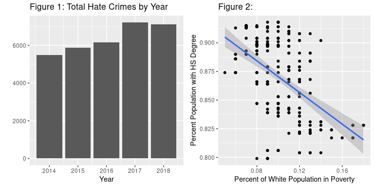
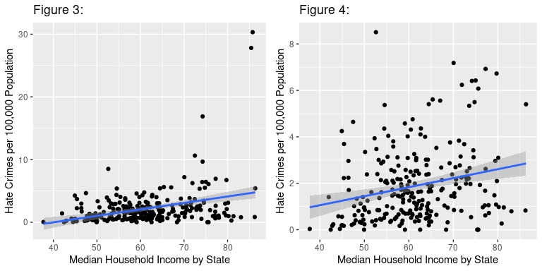
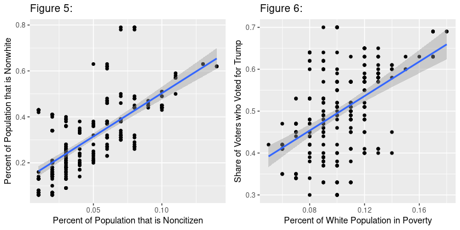
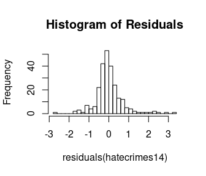

Hate crimes target people for their identity, whether for their race,
religion, sexuality, ability, or other similar attribute. Concerningly,
the annual number of hate crimes in the United States has increased in
recent years. Some research has been done on the perpetration of hate
crimes in this country, investigating factors that lead to an increase
in the rate at which they occur. However, this research has not come to
any empirical conclusions about hate crime perpetration. One common
theory about the recent increase in hate crimes in the US stems from
information about the 2016 presidential election.

Four years ago, in 2016, the election of Donald Trump as president of
the United States was met with a large amount of activity and conflict.
Something observed alongside the election was a larger-than-expected
increase in hate crimes across the United States. Some social scientists
attributed part of this increase to a proposed “Trump Effect,” where
Trump’s campaign and subsequent election are associated with the
increase in hate crimes (Edwards & Griffin, 2018). Others attributed the
rise directly to the “alt-right” movement, claiming that Trump’s
presence in the media has provided validation of their ideas (Bell,
2019). The strict numerical increase in hate crimes can be seen simply
by looking at the numbers of hate crimes in the US by year (Fig. 1). Of
course, this does not prove the Trump Effect’s existence - the recent
increase in hate crimes could be attributed to other factors. We seek to
further investigate the factors that impact the rate at which hate
crimes are perpetrated across the United States, using data from 2014 to
2018. In particular, we will explore whether the share of voters who
voted for Trump in the 2016 presidential election directly impacts the
hate crime rate. While this wouldn’t prove the Trump Effect, seeing a
significant impact on behalf of the share of votes for Trump would be
evidence supporting its validity.

    ## `geom_smooth()` using formula 'y ~ x'

We began by constructing a dataset inspired by one utilized by
FiveThirtyEight for an article written nearly four years ago (Majumder,
2017). The original dataset included a variety of information describing
the population of each state, including both racial and economic
demographics and the share of votes that went toward Donald Trump in the
2016 presidential election. While FiveThirtyEight’s dataset contained
demographic information from one point in time, we expanded on their
dataset by collecting similar demographics but for every year from 2014
through 2018. Our data was sourced from the US Census Bureau, the
Federal Bureau of Investigation, and the Kaiser Family Foundation - a
nonprofit which focuses on healthcare issues in the United States. (A
full list of our variables and their descriptions can be found in the
technical appendix.)

Our research process, after collecting all of our data, began with
exploring the information we had. First, we investigated what factors
have a relationship with our response variable, the number of hate
crimes per 100,000 people. The most noticeable relationship was with
median household income (Fig. 3). A state with a greater household
income tends to have a higher rate of hate crimes. However, this
relationship was influenced a little too much by a few outliers - these
were states with extremely high levels of hate crimes. In fact, these
points influenced many other trends we looked at as well. These outliers
represent the District of Columbia (D.C.) during various years. There
are many potential reasons for the drastic difference in the hate crime
rates of D.C. These could be anything from a more robust reporting
system to drastically different population demographics. Regardless, we
decided to remove D.C. from our analyses because it had too much
influence, allowing us to look specifically at the hate crime rates for
the 50 states. The relationship between median household income and the
rate of hate crimes remained important, even with D.C. excluded from our
data (Fig. 4).

    ## `geom_smooth()` using formula 'y ~ x'
    ## `geom_smooth()` using formula 'y ~ x'

We then continued exploring relationships between variables. We found a
strong negative correlation between a state’s share of white residents
in poverty and the share of the population with a high school degree
(Fig. 2). This means that, given two states, if one has a higher
percentage of white residents in poverty, that state is also likely to
have a smaller percentage of the population with a high school degree.
Perhaps unsurprisingly, a state’s share of nonwhite residents is highly
correlated with the share of residents who are not US citizens (Fig. 5).
Additionally, the share of white poverty in a state is associated with
that state’s share of votes cast for Trump in 2016 (Fig. 6). This aligns
with the general perception of conservatism and lack of educational
access within the Deep South and the Appalachian states.

After exploring trends within our dataset, we began developing a model
using a technique called multilevel linear regression. This allowed us
to estimate the effect of various predictive variables on the hate crime
rate of a state, while also accounting for correlation within states.
That is to say, we might see more similarity in the hate crime rate
within a state over time than across states in a given year. The
multilevel structure of our model allowed us to account for these
similarities.

    ## `geom_smooth()` using formula 'y ~ x'
    ## `geom_smooth()` using formula 'y ~ x'

We constructed a wide variety of models to try to predict the hate crime
rate, accounting for different demographics. However, we were unable to
create a model where the share of voters that voted for Donald Trump was
a significant predictor of the rate at which hate crimes are committed.
This does not mean that Trump’s increase in media presence is unrelated
to the rise in hate crimes. As we saw earlier in Figure 1, there was a
clear increase in the number of hate crimes committed in the United
States starting in 2016 and moving into the start of Trump’s presidency.
Nevertheless, we did not find Trump’s vote share to be relevant in
predicting the hate crime rate in a given state or year. Instead, we
found that the most significant model took into consideration the median
household income within a state, the percent of a state’s population
that is nonwhite, and the Gini index - a measure of income inequality
within a state. Thus, some of the most important predictors of the rate
of hate crimes are tied to a state’s economic demographics.

Our model indicates that socioeconomic factors have a large impact on
the predicted increase in hate crime rates. An increase in median
household income, as well as increased income inequality (as measured by
the Gini index), are related to an increase in the predicted rate of
hate crimes. and an increase in the share of a state’s population that
is nonwhite is related to a decrease in the rate. However, this doesn’t
mean that these are the only important factors in play. The model that
we created explains less than half (43%) of the variation within our
data, meaning that other factors also affect the frequency at which hate
crimes occur. Although socioeconomic demographics greatly influence the
hate crime rate, they are likely not the only elements at play. While
our modeling indicated that Trump’s vote share is not a significant
predictor of the rate of hate crimes, there is a lot to consider
regarding Trump’s political presence in recent years. It is possible
that accounting for the vote share for Trump in the 2020 US presidential
election and expanding our study to cover a longer timespan would reveal
a more nuanced relationship with the rate of hate crimes. However, that
is not something that we’re currently able to determine. It’s also
relevant to mention that although we did not find Trump’s voter share to
be a relevant predictor, the overall rate of hate crime perpetration in
the United States increased greatly in 2016 and has remained higher than
usual throughout the Trump presidency.

It’s important to note that our modeling results should not be
generalized too much. The socioeconomic factors that we found to be
important in predicting hate crime rates might not be as important when
considering hate crimes in other countries, or even when trying to
determine what factors were associated with hate crimes in the US ten
years ago. Either of those situations would require data and analysis
appropriate to the situation. There are also limitations to the research
we’ve conducted. For example, our data on hate crime rates comes from
the FBI, but those numbers are self-reported by police departments and
by state. Without a universal approach to data collection, we can’t be
sure that there isn’t bias built into our data through inconsistency
between states.

Despite the limitations of this study, and although we didn’t find any
evidence of the “Trump Effect,” our research still leads to important
findings. The relationships we found between the rate of hate crimes and
the income, income inequality, and nonwhite population share within a
state are key to a greater understanding of what contributes to hate
crimes, even if they aren’t a perfect explanation. More research should
be done in particular on the relationship between income inequality and
hate crimes, since our findings indicate that policies that counteract
income inequality could help to reduce hate crime rates. By analyzing
data from more recent years and taking into account Trump’s performance
in the 2020 election, further research could overcome some of the
limitations of our study, and could expand on the conclusions we have
drawn.

Technical Appendix
------------------

As mentioned in the main report, our data came from the US Census
Bureau, the Federal Bureau of Investigation, and the Kaiser Family
Foundation, with one additional variable taken from FiveThirtyEight’s
original dataset. By using mutating joins in R, we created our original
data which included the total number of hate crimes per state per year,
the population of each state, and demographic information for each
state, by year when possible. All of our variables and their
descriptions can be found in the variable dictionary above.

Summary statistics for each key variable can be found in Table 1.

<table>
<caption>
Summary Statistics of Key Variables
</caption>
<thead>
<tr>
<th style="text-align:left;">
Variable
</th>
<th style="text-align:right;">
min
</th>
<th style="text-align:right;">
Q1
</th>
<th style="text-align:right;">
median
</th>
<th style="text-align:right;">
Q3
</th>
<th style="text-align:right;">
max
</th>
<th style="text-align:right;">
mean
</th>
<th style="text-align:right;">
sd
</th>
</tr>
</thead>
<tbody>
<tr>
<td style="text-align:left;">
hate\_per
</td>
<td style="text-align:right;">
0.000
</td>
<td style="text-align:right;">
0.691
</td>
<td style="text-align:right;">
1.572
</td>
<td style="text-align:right;">
2.563
</td>
<td style="text-align:right;">
8.509
</td>
<td style="text-align:right;">
1.884
</td>
<td style="text-align:right;">
1.573
</td>
</tr>
<tr>
<td style="text-align:left;">
med1000
</td>
<td style="text-align:right;">
37.714
</td>
<td style="text-align:right;">
54.662
</td>
<td style="text-align:right;">
60.792
</td>
<td style="text-align:right;">
67.900
</td>
<td style="text-align:right;">
86.345
</td>
<td style="text-align:right;">
61.373
</td>
<td style="text-align:right;">
9.729
</td>
</tr>
<tr>
<td style="text-align:left;">
share\_voters\_voted\_trump
</td>
<td style="text-align:right;">
0.300
</td>
<td style="text-align:right;">
0.420
</td>
<td style="text-align:right;">
0.495
</td>
<td style="text-align:right;">
0.580
</td>
<td style="text-align:right;">
0.700
</td>
<td style="text-align:right;">
0.499
</td>
<td style="text-align:right;">
0.100
</td>
</tr>
<tr>
<td style="text-align:left;">
GINI2016
</td>
<td style="text-align:right;">
0.408
</td>
<td style="text-align:right;">
0.452
</td>
<td style="text-align:right;">
0.467
</td>
<td style="text-align:right;">
0.479
</td>
<td style="text-align:right;">
0.513
</td>
<td style="text-align:right;">
0.465
</td>
<td style="text-align:right;">
0.019
</td>
</tr>
<tr>
<td style="text-align:left;">
Unemployed
</td>
<td style="text-align:right;">
0.022
</td>
<td style="text-align:right;">
0.036
</td>
<td style="text-align:right;">
0.045
</td>
<td style="text-align:right;">
0.054
</td>
<td style="text-align:right;">
0.079
</td>
<td style="text-align:right;">
0.046
</td>
<td style="text-align:right;">
0.012
</td>
</tr>
</tbody>
</table>
In order to compare hate crimes between states where population varies,
we created a new variable for the rate of hate crimes per 100,000
population. We centered our median income variable around the mean and
changed the units to 1000USD in order to get more interpretable modeling
results. As mentioned in our report, the District of Columbia (D.C.) was
an outlier in many demographics, and heavily influenced our analysis.
D.C. is quite different from the other locations in our dataset, being
the only non-state and having very unique demographics, which cause it
to be an outlier in almost every variable. Because of this, we removed
the 5 observations of D.C. from the dataset to look specifically at the
50 states. This left us with 250 total observations: one per state for
each year from 2014 to 2018.

Given our longitudinal data structure, we used a multilevel linear model
to represent our data. Through our exploratory data analysis, we noted
apparent relationships between economic factors such as the median
household income, the Gini index, the unemployment rate, and the rate of
hate crimes. We also noticed a similar association between hate crime
rate and the percent of the population that is non-white and
non-citizen. We considered these relationships when fitting our model,
but we were unable to fit a model where the share of voters that voted
for Trump in the 2016 election was a significant predictor. Our final
model instead accounted for median household income, the Gini index in
2016, and the percentage of the population that is nonwhite.

Parameter estimates and standard errors are found in Table 2.

<table>
<caption>
Table of Parameter Estimates
</caption>
<thead>
<tr>
<th style="text-align:left;">
Variable
</th>
<th style="text-align:right;">
Estimate
</th>
<th style="text-align:right;">
Std.Error
</th>
<th style="text-align:right;">
t.value
</th>
</tr>
</thead>
<tbody>
<tr>
<td style="text-align:left;">
Intercept
</td>
<td style="text-align:right;">
-11.76299
</td>
<td style="text-align:right;">
4.58138
</td>
<td style="text-align:right;">
-2.568
</td>
</tr>
<tr>
<td style="text-align:left;">
med1000.2
</td>
<td style="text-align:right;">
0.05708
</td>
<td style="text-align:right;">
0.01304
</td>
<td style="text-align:right;">
4.378
</td>
</tr>
<tr>
<td style="text-align:left;">
GINI2016
</td>
<td style="text-align:right;">
31.94519
</td>
<td style="text-align:right;">
10.12394
</td>
<td style="text-align:right;">
3.155
</td>
</tr>
<tr>
<td style="text-align:left;">
Nonwhite
</td>
<td style="text-align:right;">
-3.86226
</td>
<td style="text-align:right;">
1.19606
</td>
<td style="text-align:right;">
-3.229
</td>
</tr>
</tbody>
</table>

From examining the residual plot from our model, it was clear that the
residuals follow a normal distribution, thus a linear model was
appropriate, as the residuals showed no form. We were slightly concerned
about the equal variance assumption, but felt that a multilevel modeling
structure was appropriate nonetheless. Our model was only able to
account for about 43% of the variation in our data, and so there are
many other variables that could play into the rate at which hate crimes
are committed. From our model, we saw that in the average state, an
increase of $1,000 in median household income is associated with a
predicted increase in 0.057 hate crimes per 100,000 population after
accounting for income inequality and the percentage of population that
is nonwhite. Further, an increase in 0.01 points on the Gini index is
associated with a predicted increase of 0.319 hate crimes per 100,000
population after accounting for the median household income and the
percentage of the population that is nonwhite.

Response to Peer Review
-----------------------

After receiving comments from our peer review partner, we learned that
we were in a pretty solid spot for revisions. We found that a couple of
our interpretations of sigificant predictors could be expanded on to
tell a better story about our data, and so we reevaluated our
interpretations to provide new insight. We also received feedback on how
to make our paper look more professional in plots, and we edited those
to improve their appearance. We found the peer review helpful as our
partner reassured us that our report was accessible to a general
audience. Overall, peer review was helpful, we really enjoyed getting to
see someone else’s work as that helped us more than the comments on our
own paper. Due to the stage that we were at in our writing process,
looking at other work provided more insight than comments on our own.

References
----------

Bell, Jeannine. (2019). The Resistance & the Stubborn but Unsurprising
Persistence of Hate and Extremism in the United States. *Indiana Journal
of Global Legal Studies*, 26(1),305–316.
<https://doi.org/10.2979/indjglolegstu.26.1.0305>

Edwards, Griffin Sims and Rushin, Stephen (2018). The Effect of
President Trump’s Election on Hate Crimes. *Social Science Research
Network*. <http://dx.doi.org/10.2139/ssrn.3102652>

Majumder, Maimuna. (2017). Higher Rates of Hate Crimes are Tied to
Income Inequality. *FiveThirtyEight*. Retrieved from
<https://fivethirtyeight.com/features/higher-rates-of-hate-crimes-are-tied-to-income-inequality/>
